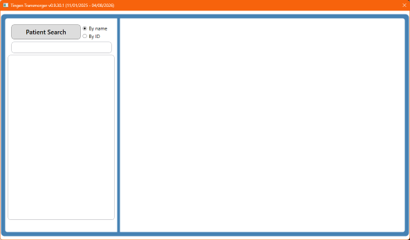

<!-- 260415 -->

<!--
  This section contains the project logo and various details.

  There are references for both a "light" and "dark" images. The dark image
  should have a background of HEX #0d1117, to match the dark mode of GitHub.
  The light image is the fallback.
-->

  <picture>
    <source media="(prefers-color-scheme: dark)" srcset=".github/repository/logo/TransmorgerLogo-256x256.png">
    <source media="(prefers-color-scheme: light)" srcset=".github/repository/logo/TransmorgerLogo-256x256.png">
    
  </picture>

  &nbsp;&nbsp;&nbsp;&nbsp; 
  &nbsp;&nbsp;&nbsp;&nbsp;

***

<!--
  Optional screenshot
-->

  
  <figcaption>The Tingen Transmorger main window</figcaption>

<!--
  Optional menu.

  These are things that aren't/don't belong in the Table of Contents.

  Use whichever components you want/need. 
-->

<h6 align="center">

[Changelog](docs/CHANGELOG.md)&nbsp;&bull;&nbsp;[Roadmap](docs/ROADMAP.md)&nbsp;&bull;&nbsp;[Known issues](docs/KNOWN-ISSUES.md)

</h6>

<!-- 
  Table of contents.

  These are things that aren't/don't belong in the Menu.
-->

***

  #### CONTENTS
  * [About Tingen Transmorger](#about-tingen-transmorger) 
    * [The Transmorger Database](#the-transmorger-database) 
  * [Requirements](#requirements) 
  * [Getting Started](#getting-started) 
  * [Development](#development) 
  * [Additional Information](#additional-information) 

***
# About Tingen Transmorger

Troubleshooting [Netsmart's TeleHealth](https://www.ntst.com/carefabric/careguidance-solutions/telehealth) platform can be frustrating; data is spread across multiple reports which use inconsistent syntax, and are not end-user friendly.

**Tingen Transmorger** is a utility ***transmorgifies*** those reports, and makes it easy to find information like:

- Patient alert details (deliver successes/failures, etc.)
- Patient connection details (devices/operating systems used, etc.)
- Meeting details (start/end time, when participants joined, participant list, etc.)
- Meeting quality (bandwidth, audio/video quality, etc.)

And most of the information in Transmorger can easily be copy/pasted into other documentation, emails, and tickets.

## The Transmorger Database

The heart of Transmorger is its Database, which aggregates multiple TeleHealth reports into a single, well organized collection of data that:

- Contains information from date ranges *you* choose
- Can be added to *on-the-fly*, with dates/date ranges *you* choose
- Is updated for end-users *automatically*, ensuring users have the latest available details to work with

## Requirements

- [.NET 10](https://dotnet.microsoft.com/en-us/download/dotnet/10.0)
- 64bit Operating System (only tested on Windows)
- Access to Netsmart TeleHealth reports

## Getting Started

Please see the [Tingen Transmorger manual](https://github.com/spectrum-health-systems/TingenTransmorger/blob/main/docs/man/README.md).

# Development

Tingen Transmorger is being [actively developed](https://github.com/spectrum-health-systems/TingenTransmorger/tree/development).

## Contributing

If you are interested in contributing to this project, please see the:

- [Code of conduct](https://github.com/APrettyCoolProgram/.github/blob/main/.github/CODE_OF_CONDUCT.md)
- [Contributing guidelines](https://github.com/APrettyCoolProgram/.github/blob/main/.github/CONTRIBUTING.md)
* [Issue templates](https://github.com/APrettyCoolProgram/.github/blob/main/.github/ISSUE_TEMPLATE/)
* [Pull request template](https://github.com/APrettyCoolProgram/.github/blob/main/.github/PULL_REQUEST_TEMPLATE/)

# Additional Information

- [Repository](https://github.com/spectrum-health-systems/Tingen-Transmorger)
- [Documentation](docs/)

***
