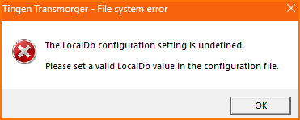

# Tingen Transmorger

Tingen Transmorger is a utility for Netsmart's Avatar TeleHealth platform.

## Usage

### Downloading Tingen Transmorger

1. Download the latest [release]()
2. Extract the `TingenTransmorger.exe` file to a location of your choice.

> [!IMPORTANT]
> Verify the SHA256 hash!
> `9e0c6522f3e87c1c361207ee9dd828b65c8ef9d8803b3a5b6863aef645142b54`

3. Run `TingenTransmorger.exe`

You will get this popup:

