[Tingen Transmorger Manual](README.md)

***

<div align="center">

  

  &nbsp;&nbsp; 

  <h1>TINGEN TRANSMORGER MANUAL</h1>

</div>

***

### CONTENTS

- [Introduction](#introduction)
  - [The Transmorger Database](#the-transmorger-database)
  - [Requirements](#requirements)
  - [How it works](#how-it-works)
  - [Additional documentation](#additional-documentation)
- [Installing](#installing)
- [Setup](#initial-setup)
  - [Creating the LocalDb path](#setup-type-thing-1-creating-the-localdb-path)
- [Configuration](#configuration)
  - [The MasterDb path](#setup-type-thing-2-the-masterdb-path)
  - [The Transmorger configuration file](#the-tranmorger-configuration-file)
  - [The default configuration file](#the-default-configuration-file)
      - [Mode](#mode)
      - [Standard directories](#standard-directories)
      - [Admin directories](#admin-directories)
    - [Modifying the configuration file](#modifying-the-configuration-file)
    - [Modifying the MasterDb location](#modifying-the-masterdb-location)
    - [Modifying the Import location](#modifying-the-import-location)
- [TeleHealth reports]()
  - [Required reports](#required-reports)
  - [Report date range](#report-date-range)
  - [Running reports](#running-reports)
  - [Downloading reports](#downloading-reports)
  - [Report names](#report-names)
  - [Capturing all data](#capturing-all-data)
  - [Report aggregation](#report-aggregation)
  - [Missing dates](#missing-dates)
- [The database(s)](#the-transmorger-databases)
  - [The local database (LocalDb)](#the-local-database-localdb)
  - [The master database (MasterDb)](#the-master-database-masterdb)
  - [How the database(s) work](#how-the-databases-work)
  - [Rebuilding the master database](#rebuilding-the-master-database)
- [Using](#using)
- [The Transmorger user interface](#the-transmorger-windows)
  - [The Main window](#the-main-window)
  - [The Message Details window](#the-message-details-window)
  - [The Message Details buttons](#the-message-details-button)
  - [The Copy Data buttons](#the-copy-data-buttons)
- [Performing a patient search](#performing-a-patient-search)
  - [Reviewing patient phone details](#reviewing-patient-phone-details)
  - [Reviewing patient email details](#reviewing-patient-email--details)
  - [Reviewing patient meeting message details](#reviewing-patient-meeting--details)
- [Performing a provider search](#performing-a-provider-search)
  - [Reviewing patient meeting message details](#reviewing-provider-meeting--details)
- [Development](#development)

***

# Introduction

Troubleshooting [Netsmart's TeleHealth](https://www.ntst.com/carefabric/careguidance-solutions/telehealth) platform can be frustrating; data is spread across multiple reports which use inconsistent syntax, and are not end-user friendly.

**Tingen Transmorger** is a utility ***transmorgifies*** those reports, and makes it easy to find information like:

- Patient alert details (deliver successes/failures, etc.)
- Patient connection details (devices/operating systems used, etc.)
- Meeting details (start/end time, when participants joined, participant list, etc.)
- Meeting quality (bandwidth, audio/video quality, etc.)

And most of the information in Transmorger can easily be copy/pasted into other documentation, emails, and tickets.

## The Transmorger Database

The heart of Transmorger is its Database, which aggregates multiple TeleHealth reports into a single, well organized collection of data that:

- Contains information from date ranges *you* choose
- Can be added to *on-the-fly*, with dates/date ranges *you* choose
- Is updated for end-users *automatically*, ensuring users have the latest available details to work with

## Requirements

- [.NET 10](https://dotnet.microsoft.com/en-us/download/dotnet/10.0)
- 64bit Operating System (only tested on Windows)
- Access to Netsmart TeleHealth reports

## How it works

Here's the 50,000-foot view of how Tingen Transmorger works:

- TeleHealth reports are (manually) run from the TeleHealth portal
- The completed reports are downloaded
- Transmorger takes all of the downloaded reports and ***transmorgifies*** them into a single, custom database
- That custom database is saved in a location that end-users have access to
- Transmorger automatically downloads/updates the database for end-users
- End-users can use Transmorger to troubleshoot TeleHealth issues

# Installing

Tingen Transmorger is a stand-alone, portable, and (in theory) cross-platform application.

To install Transmorger, just:

1. Download the latest [release](https://github.com/spectrum-health-systems/TingenTransmorger/releases)
2. Extract the `TingenTransmorger.exe` file to a location of your choice

> [!WARNING]
> Verify the SHA256 hash!  
> ```text
> Name: TingenTransmorger-0.9.31.0.7z
> Size: 39.6 MB (41,531,038 bytes)
> SHA256: 80ef3ef83669daa9e2884c092afbe024761502d92ef9303772394e29b09bb5c3 
> ```

# Setup

When you double-click on the `TingenTransmorger.exe` file, and launch it for the first time, it does a few setup-type things, including:

* Creating the `./AppData/` folder
* Creating the `./AppData/Config/` folder
* Creating the `./AppData/Config/transmorger.config` file
* Prompt the user to create the `LocalDb` path
* Warn the user about the `MasterDb` path

## Creating the LocalDb path

The when you launch Transmorger for the first time, you should see this popup:

<div align="center">

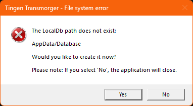

</div>

The ***LocalDb path*** is where the *local copy* of the Transmorger database will stored.

When you click **Yes**, Transmorger will create an empty folder named `./AppData/Database/`. This is the default (and recommended) location for the LocalDb, but you can change the path to any location via the configuration file.

Click **Yes**.

> [!WARNING]
> Clicking **No** will exit Transmorger.  
> Subsequent launches will ask the same question, until you click **Yes**, so this step is required.

## The MasterDb path warning

After creating the LocalDb path, you should get the following popup:

<div align="center">

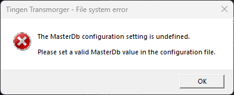

</div>

The **MasterDb** is the most up-to-date version of the Transmorger database...but it doesn't actually exist yet. In fact, it doesn't even have a *location* to exist in!

We'll fix that next, so for now just click **OK**, and Transmorger will exit.

# Configuration

If you take a look in the folder where `TingenTransmorger.exe` is, you'll notice there is a folder named `AppData`, which is where Transmorger will store various data that it needs to function.

You'll also see the `AppData/Database` folder that was *just created* for the `LocalDb`.

We're interested in other folder here: `AppData/Config`, which contains the `transmorger.config` configuration file.

## The Tranmorger Configuration file

The Transmorger **configuration file**:

- is named `transmorger.config`
- is located in `AppData/Configuration`
- is stored as a standard, prettified JSON file
- contains the settings that Transmorger needs to run

## The default configuration file

The default `transmorger.config` file looks like this:

```json
{
  "Mode": "Standard",
  "StandardDirectories": {
    "LocalDb": "AppData/Database",
    "MasterDb": ""
  },
  "AdminDirectories": {
    "Tmp": "AppData/Tmp",
    "Import": ""
  }
}
```

There are three components to the configuration file:

- Mode
- StandardDirectories
- AdminDirectories

### Mode

There are two modes that Transmorger can run in:

- **Standard**  
This is the mode that end-users should always use.

- **Admin**  
This mode is used for rebuilding the Transmorger database, and is *not* intended for end-users. You can find more information about this mode.

### Standard directories

Standard mode uses two directories:

- **LocalDb**  
This is the location for the end-users local Transmorger database. As you can see, when Transmorger is executed for the first time, and the configuration file is created, this is set to the default (and recommended) `AppData/Database`.

- **MasterDb**  
This is the location for the **master database**. The master database is the most up-to-date version of the Transmorger database, and is must be located in a location where all end-users can access it.

### Admin directories

Admin mode uses two **additional** directories:

- **Tmp**  
Any temporary data that Transmorger needs to function is stored here. When Transmorger is executed for the first time, this is set to `AppData/Tmp`, which is the recommended location.

- **Import**  
This is the location for the TeleHealth reports that will be ***transmorgified***. This can be anywhere, but for organizational purposes I recommend putting it in the parent folder of the `MasterDb`.

## Modifying the configuration file

We are going to make the following changes to the `transmorger.config`:

- For **standard** users, we are only going to modify the ***MasterDb*** setting.
- For **admin** users, we are going to modify both the ***MasterDb*** and ***Import*** settings.

Notice that we're leaving the existing ***LocalDb*** and ***Tmp*** defaults.

So, open the `transmorger.config` file in a text editor.

### Modifying the MasterDb location

The ***MasterDb*** component of the configuration file needs to point to where your master database will reside.

So this:

```json
    "MasterDb": ""
```

...becomes this:

```json
    "MasterDb": "path/to/database"
```

...or a more real-world example:

```json
    "MasterDb": "Z:/Transmorger/Database"
```

### Modifying the `Import` location

Modify this component of the configuration file to point to where all TeleHealth reports will downloaded.

So this:

```json
    "Import": ""
```

...becomes this:

```json
    "MasterDb": "path/to/imports"
```

...or a more real-world example:

```json
    "MasterDb": "Z:/Transmorger/Import"
```

## Saving the configuration file

Your modified `transmorger.config` file should look something like this:

```json
{
  "Mode": "Standard",
  "StandardDirectories": {
    "LocalDb": "AppData/Database",
    "MasterDb": "Z:/Transmorger/Database"
  },
  "AdminDirectories": {
    "Tmp": "AppData/Tmp",
    "Import": "Z:/Transmorger/Database"
  }
}
```

Save the changes.

Tingen Transmorger is now configured!

# Initializing the Master Transmorger database

That last thing was only *mostly* true: Tingen Transmorger needs one more configuration change, but it's a temporary one.

We need to change the **Mode** to "Admin", so we can build the initial Transmorger database.

So open the `transmorger.config` file, and change this line:

```json
    "Mode": "Standard",
```

...to this:

```json
    "Mode": "Admin",
```

...then save the configuration file.

But don't launch Transmorger yet! To build the Transmorger database, we need TeleHealth reports.

# Running the TeleHealth reports

For detailed instruction on how to run and download TeleHealth reports, please see the [TeleHealth reports](TeleHealth-Reports.md#running-reports) documentation.

# Creating the Master Transmorger database

Now that we have the necessary TeleHealth reports, launch Transmorger.

You'll get the following popup:

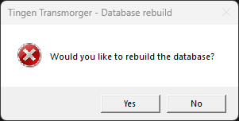

Click **Yes** to initialize the Transmorger database (which, technically, is just "rebuilding" it for the first time).

While the database is being built, you'll see a progress indicator:

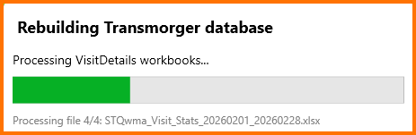

When the build process is complete, you'll see a popup letting you know there is a database update available.


> [!NOTE]
> When you rebuild the Transmorger database, you are rebuilding the **master** database.
>
> Once that is complete, Transmorger checks the local version of the database to see if it's older than the master (which, in this case, it is), and prompts you to update.

Since we want that update, click **Yes**

You will then (hopefully) get a popup letting you know the database has been updated.

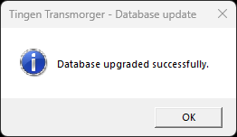

Click *OK*, then click the "Close" button on the "Rebuilding Transmorger Database" window.

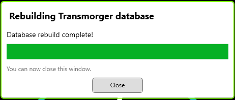

Tingen Transmorger will then launch in Admin mode.

Exit Transmorger, and put it back into "Standard" by modifying the configuration file from this:

```json
    "Mode": "Admin",
```

...to this:

```json
    "Mode": "Standard",
```

That's it! Transmorger is now ready to use!

# The database(s)

*Technically*, Transmorger uses two databases: the ***LocalDb***, and the ***MasterDb***.

## The local database (LocalDb)

The **LocalDb**:

- is named `transmorger.db`
- is located in `AppData/Database` (by default)
- is what Transmorger uses to do all of it's work
- is stored as a standard JSON file, to keep filesize down

Each Transmorger installation should have it's own LocalDb.

**Fun fact**: When Transmorger is launched, it checks to see if there is an updated version of the LocalDb. If there is an updated version, the user is prompted to update!

## The master database (MasterDb)

The **MasterDb**:

- is also named `transmorger.db`
- should be located where all end-users have access
- is only modified when building/rebuilding the database in *Admin mode*
- is always the most up-to-date version of the Transmorger database

**Fun fact**: End-users will probably never see the MasterDb!

# How the database(s) work

If you want something visual (that's not too abysmal):

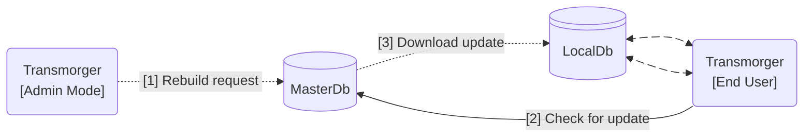

>[1] Transmorger Admin mode can request that the MasterDb be rebuilt  
>[2] When an end-user launches Transmorger, it checks to see if the MasterDb is more current than it's LocalDb  
>[3] If the MasterDb is more current than the LocalDb, the MasterDb is copied to the end-user's machine, overwriting the current LocalDb
>
> The end-user communicates directly with the LocalDb

# Rebuilding the master database

To rebuild the MasterDb:

1. [Run the TeleHealth reports](TeleHealth-Reports.md#running-reports) with the date/date-ranges you want Transmorger to use
2. Change the Transmorger mode to "Admin" in the `./AppData/Config/transmorger.config` file
3. Launch Transmorger

The rebuild process should start.

## The rebuild process

You should get this prompt:


Click **Yes**.

While the database is being built, you'll see a progress indicator:


When the build process is complete, you'll see a popup letting you know there is a database update available.


Click **Yes**

You will then (hopefully) get a popup letting you know the database has been updated.


Click *OK*


Tingen Transmorger will then launch in Admin mode.

Exit Transmorger, change the mode to "Standard", and relaunch Transmorger as an end-user.


# Required reports

In order for Transmorger to do what it does, and do it accurately, it needs these reports:

1. Visit Details
2. Message Failure
3. Message Delivery
4. Visit Stats

# Report date range

Each report requires a ***Start Date*** and an ***End Date***.

You can run a report for a single day by setting the *Start Date* and *End Date* to the same day.

# Running reports

To run a TeleHealth reports:

1. Login to your TeleHealth portal
2. Click the **Reports** tab
3. Choose a report to run
4. Choose the start and end date of the report
5. Click **Run Report**

Using the **Message Delivery Report** as an example:

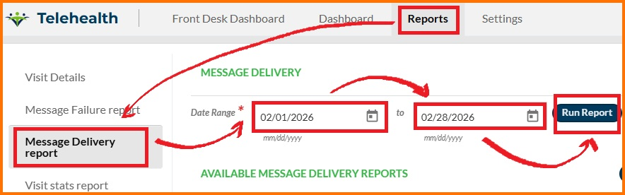

Some reports take longer than others, and some reports take pretty long.

While the report is being run, you'll see a **Processing** button (that's disabled).

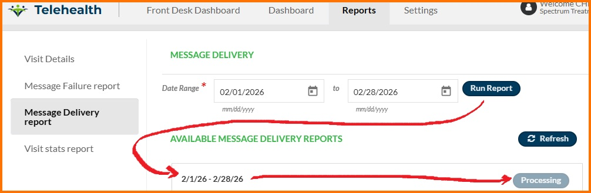

> [!NOTE]
> All TeleHealth reports in the Import folder are used to create the Transmorger database, so you can download incremental date ranges.
>
> For example, running two reports from 1/1/2026-1/15/2015 and 1/16/20206-1/31/2026 will give you the same result as running a single report from 1/1/2026-1/31/2-26.

# Downloading reports

Once the **Processing** button becomes the **Download** button (which is enabled), download the report to your **Import/** folder.


# Report names

Downloaded report names look like this:

```text
STQma_%Report_Name%_%StartDate_EndDate%.xlsx
```
Where:

- `%Report_Name%` is the name of the report (e.g., `Message_Delivery`).

- `%StartDate_EndDate%` is the date-range (e.g., `YYYYMMDD_YYYYMMDD`).

So if you run the "Visit Details" report for 5/1/2026 - 5/15/20206, the name of the report would be:

```text
STQma_Visit_Details_20260501_20260515.xlsx
```

In order to troubleshoot TeleHealth for the month of May 2026, you would need the following reports:

```text
STQma_Visit_Details_20260501_20260531.xlsx
STQma_Message_Failure_20260501_20260531.xlsx
STQma_Message_Delivery_20260501_20260531.xlsx
STQma_Visit_Stats_20260501_20260531.xlsx
```

## Capturing all data

In order to capture all data for a date/date-range. is recommended that you run reports once that date/range has passed.

For example, to get all data for 5/1/2026 - 5/15/20206, run the report on 5/16/26.

## Report aggregation

Since Transmorger aggregates *all* of the reports in the Import/ folder, you can run reports for shorter date-ranges that add up to larger date-ranges.

For example, the following reports would *also* build data for all of May 2026:

```text
STQma_Visit_Details_20260501_20260531.xlsx

STQma_Message_Failure_20260501_20260515.xlsx
STQma_Message_Failure_20260516_20260531.xlsx

STQma_Message_Delivery_20260501_20260510.xlsx
STQma_Message_Delivery_20260511_20260520.xlsx
STQma_Message_Delivery_20260521_20260531.xlsx

STQma_Visit_Stats_20260501_20260510.xlsx
STQma_Visit_Stats_20260511_20260520.xlsx
STQma_Visit_Stats_20260521_20260530.xlsx
STQma_Visit_Stats_20260531_20260531.xlsx
```

## Missing dates

If a report for a specific date does not exist, that data will not be included in the Transmorger database. All other dates will be included.

For example, if you ran reports for **5/1/26 - 1/15/26** and **5/17/26 - 5/31/26**, but *not* for **5/16/26**, data would exist for all of May 2026 *except* for 5/16/26.

This could be resolved by running reports with a start *and* end date of 5/16/25, and adding that report the the Import/ folder.


> [!NOTE]
> The screenshots in this documentation are directly from the XAML editor in Visual Studio 2026, since using a production version of Transmorger would display patient data.

***

# The Transmorger user interface

The primary interfaces you will be working with are:

1. The **Main** window
2. The **Message Details** window
3. The **Message Details** buttons
4. The **Copy data** buttons

## The Main window


1. **Search toggle button**  
Clicking this button will toggle between **Patient Search** and **Provider Search**.

2. **Search By options**  
You can either search by **name** or **ID number**...but not both!

3. **Search box**  
When you type a letter (when searching by name) or number (when searching by ID), the **search results** will populate.

4. **Search results**  
Real-time search results.

5. **Patient/Provider details**  
Patient searches will display the patient name and ID.  
Provider searches will display the provider name and ID.

6. **Patient contact information**  
The patient phone number and email address will be displayed here, if they exist.  
If a contact method has any combination of successes/failures, the **Message Detail button** for that method will be available (see [the Message Detail button](#the-message-details-button)).  
This component is not used with provider searches.

7. **Meeting list**  
When you choose one of the results in the *search results* a summary of completed/in-progress/expired/cancelled/scheduled meetings will be displayed, as well as the list of meetings for the patient/provider.

8. **Meeting details**  
Displays various *generic* details about the chosen meeting.

9. **Meeting details (patient)**  
Displays various *patient-specific** details about the chosen meeting.
This component is not used with provider searches.

10. **Meeting details (provider)**  
Displays various *patient-specific** details about the chosen meeting.
This component is not used with patient searches.

## The Message Details window


1. **Message details summary**  
A summary of total messages, successful messages, and failed messages.

2. **Copy buttons**  
Clicking one of these buttons will copy specific data to the clipboard (see [the Copy Data buttons](#the-copy-data-buttons))

3. **Message detail results**  
Displays various details about messages.

## The message details button

When performing a patient search, both the **phone** and **email** contacts will have a **message detail button**. This button will be in one of four states:

- **Disabled/grey**  
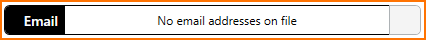  
This indicates that a phone number/email address was not found, or that delivery information does not exist, so the message details button is greyed out and disabled.

- **Green**  
  
This indicates that a phone number/email address was found, along with only successful delivery information. Clicking the button will open the Message Details window.

- **Yellow**  
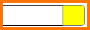  
This indicates that a phone number/email address was found, along with a mix of successful and failed delivery information. Clicking the button will open the Message Details window.

- **Red**  
  
This indicates that a phone number/email address was found, along with only failure delivery information. Clicking the button will open the Message Details window.

## The Copy Data buttons

You'll find the following **copy** icons on various components:

- **Copy all data**  
  
Clicking this icon will copy all of the data in the component.

- **Copy the top 10 results**  
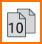  
Clicking this icon will copy the top ten results of a component.

- **Copy successes**  
  
Clicking this icon will copy any data that is classified as "successful".

- **Copy failures**  
  
Clicking this icon will copy any data that is classified as "failure".

- **Copy both success and failures**  
  
Clicking this icon will copy any data that is classified as either "successful" or "failure" (essentially all data).

# Performing a patient search

To perform a patient search:

1. Verify the **search toggle button** says "Patient Search". If it does not, click it.
2. Choose to search by **name** or **ID** (for this example we will search by name)
3. Start typing the patient name in the **search box**
4. When the result you are looking for appears, click it

Patient name, ID, and meeting list will be displayed. If the patient has an associated phone number or email address, that information will also be displayed.

## Reviewing patient phone details

If the patient has a phone number, it will be displayed. If there are successful/failed deliveries to the phone number, you can click on the **message details button** to display additional information.

## Reviewing patient email details

If the patient has an email address, it will be displayed. If there are successful/failed deliveries to the email address, you can click on the **message details button** to display additional information.

## Reviewing patient meeting details

A sortable list of meetings associated with the patient will be displayed. Click on a meeting to display various details.

# Performing a provider search

To perform a provider search:

1. Verify the **search toggle button** says "Provider Search". If it does not, click it.
2. Choose to search by **name** or **ID** (for this example we will search by name)
3. Start typing the provider name in the **search box**
4. When the result you are looking for appears, click it

The provider name, ID, and meeting list will be displayed.

## Reviewing provider meeting details

A sortable list of meetings associated with the provider will be displayed. Click on a meeting to display various details.


# Development

Tingen Transmorger is being [actively developed](https://github.com/spectrum-health-systems/TingenTransmorger/tree/development).

***

[Tingen Transmorger manual](README.md)

> <sub>Last updated: 260415</sub>
