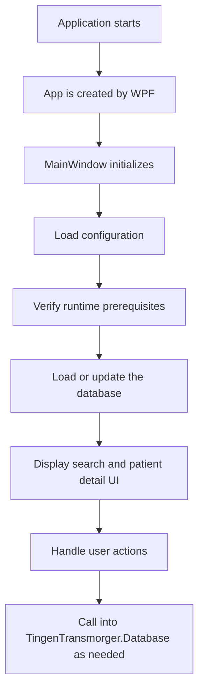

[Source Code Documentation](../README.md) ❭ [Namespace](README.md) ❭ TingenTransmorger namespace

  <picture>
    <source media="(prefers-color-scheme: dark)" srcset="../../../.github/repository/logo/TransmorgerLogo-256x256.png">
    <source media="(prefers-color-scheme: light)" srcset="../../../.github/repository/logo/TransmorgerLogo-256x256.png">
    
  </picture>

  <h1>TingenTransmorger namespace</h1>

***

> [!NOTE]
> See the [API documentation](%ApiDocumentationUrl) for the source-level reference for this namespace.

***

## Overview

The `TingenTransmorger` namespace contains the application’s primary WPF entry points and UI orchestration logic. It is the top-level namespace used by the desktop application to start, display, and shut down the main window, while delegating data access and report processing to supporting namespaces such as `TingenTransmorger.Database` and `TingenTransmorger.Core`.

In practice, this namespace is responsible for:

- starting the WPF application
- hosting the main window
- coordinating application startup and shutdown
- handling user-driven UI events
- bridging the UI with database and configuration services

## Classes

### `App`

> [`App`](src/App.xaml.cs)

The WPF application class. It defines the application’s entry-point container and provides the runtime shell used by `App.xaml`.

### `MainWindow`

> [`MainWindow`](src/MainWindow/MainWindow.xaml.cs)

The main UI window for the application. It initializes the app, loads configuration, verifies prerequisites, opens the Transmorger database, and wires up the event handlers used by the user interface.

## Request flow

## How the namespace is used

A typical flow in this namespace is:

1. WPF creates `App` and starts the desktop application.
2. `MainWindow` initializes and loads application configuration.
3. The app verifies required folders and environment settings.
4. The Transmorger database is loaded or rebuilt.
5. The UI responds to user actions such as searching, viewing patient details, copying results, or rebuilding the database.

## Related namespaces

| Namespace | Description |
| --- | --- |
| `TingenTransmorger.Database` | Database loading, querying, diagnostics, and rebuild operations. |
| `TingenTransmorger.Core` | Shared application services such as configuration and framework verification. |
| `TingenTransmorger.TeleHealthReport` | TeleHealth report processing and related domain logic. |

## Notes

- This namespace is the application-facing layer of the solution.
- Most business logic lives in helper namespaces and partial classes, while `TingenTransmorger` coordinates the UI workflow.
- The implementation is WPF-based and centered around `MainWindow`.

***

[Source Code Documentation](../README.md) ❭ [Namespace](README.md) ❭ TingenTransmorger namespace

<!-- R26.6 -->